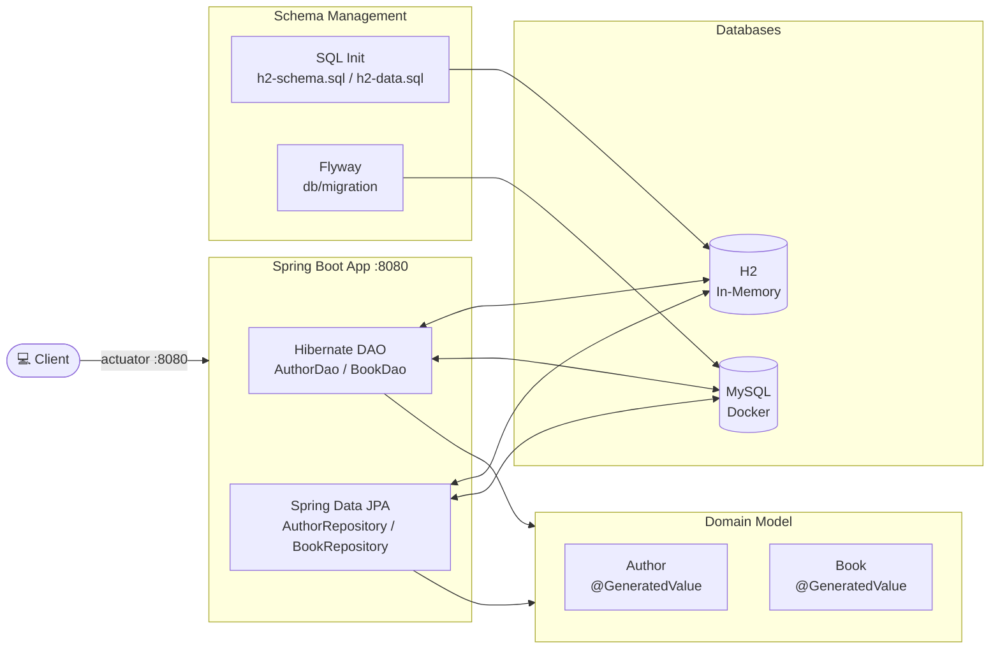
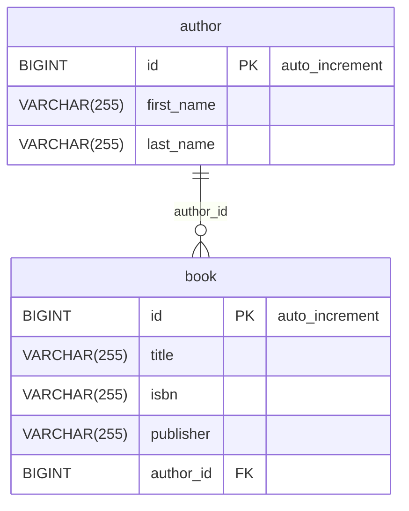

# Spring Data JPA - Hibernate DAO

Spring Boot 4 / Spring Data JPA demo project on Java 25, demonstrating Hibernate DAO
implementations (`EntityManagerFactory`, JPQL, named queries, native SQL, Criteria API) and Spring
Data JPA repositories against H2 (MySQL-compat mode) and MySQL, with schema management via Flyway
and SQL init scripts.

## Architecture Overview



## Database Schema



`book.author_id` is a plain foreign key column: the relationship is enforced at the database level
(see the Flyway migration `src/main/resources/db/migration/V1__init_database.sql`) but is not mapped
as a JPA association. H2 creates the tables from `src/main/resources/h2-schema.sql`, MySQL from the
Flyway migration; seed data comes from `h2-data.sql` (H2) and the migration (MySQL).

## Build & Test

```bash
./mvnw clean verify          # full build: format check, unit (*Test) + IT (*IT) tests, Helm lint/template
./mvnw clean install         # verify + build local Docker image + package Helm chart
./mvnw test                  # unit tests only (surefire, H2)
./mvnw verify                # integration tests only (failsafe, MySQL via Docker)
./mvnw test -Dtest=BookDaoImplTest              # single test class
./mvnw test -Dtest=BookDaoImplTest#findByIsbn   # single test method
./mvnw spotless:apply        # auto-fix pom/markdown/json/yaml/shell formatting
./mvnw spring-javaformat:apply                   # auto-fix Java code style
```

> Formatting is enforced at the `validate` phase. Run both `spotless:apply` and
> `spring-javaformat:apply` before committing if the build fails there.
> Skip the in-build app boot with `-Dskip.start.stop.springboot=true` and the Docker build with
> `-Dskip.docker.build=true`.

## Flyway

Flyway is enabled by default in the MySQL profile with the following properties in
`application-mysql.yaml`:

- `spring.flyway.enabled = true`
- `spring.docker.compose.file = compose-mysql.yaml`

This profile starts MySQL on port 3306 using the Docker Compose file `compose-mysql.yaml`. The
migration scripts live in `src/main/resources/db/migration` (starting with `V1__init_database.sql`)
and are applied whenever the application starts. Because the local MySQL container starts from an
empty database, all migrations are always applied.

## Docker

The Docker Compose file initially uses the startup script located in `src/scripts`. This script
creates the database and users.

## Kubernetes

### Generate Config Map for mysql init script

When updating `src/scripts/init-mysql.sql`, regenerate the Kubernetes ConfigMap:

```powershell
kubectl create configmap mysql-init-script --from-file=init.sql=src/scripts/init-mysql.sql --dry-run=client -o yaml | Out-File -Encoding utf8 k8s/mysql-init-script-configmap.yaml
```

### Deployment with Kubernetes

Deployment goes into the **default** namespace when using raw manifests, or the
**`sdjpa-hibernate-dao`** namespace when using Helm.

To deploy all resources:

```bash
kubectl apply -f target/k8s/
```

To remove all resources:

```bash
kubectl delete -f target/k8s/
```

Check

```bash
kubectl get deployments -o wide
kubectl get pods -o wide
```

You can use the actuator rest call to verify via port 30080

## Deployment with Helm

Be aware that we are using a different namespace here (not default).

Go to the directory where the tgz file has been created after 'mvn install'

```powershell
cd target/helm/repo
```

unpack

```powershell
$file = Get-ChildItem -Filter sdjpa-hibernate-dao-chart-*.tgz | Select-Object -First 1
tar -xvf $file.Name
```

install

```powershell
$APPLICATION_NAME = Get-ChildItem -Directory | Where-Object { $_.LastWriteTime -ge $file.LastWriteTime } | Select-Object -ExpandProperty Name
helm upgrade --install $APPLICATION_NAME ./$APPLICATION_NAME --namespace sdjpa-hibernate-dao --create-namespace --wait --timeout 5m --debug --render-subchart-notes
```

show logs and show event

```powershell
kubectl get pods -n sdjpa-hibernate-dao
```

replace $POD with pods from the command above

```powershell
kubectl logs $POD -n sdjpa-hibernate-dao --all-containers
```

Show Details and Event

$POD_NAME can be: sdjpa-hibernate-dao-mysql, sdjpa-hibernate-dao

```powershell
kubectl describe pod $POD_NAME -n sdjpa-hibernate-dao
```

Show Endpoints

```powershell
kubectl get endpoints -n sdjpa-hibernate-dao
```

test

```powershell
helm test $APPLICATION_NAME --namespace sdjpa-hibernate-dao --logs
```

uninstall

```powershell
helm uninstall $APPLICATION_NAME  --namespace sdjpa-hibernate-dao
```

delete all

```powershell
kubectl delete all --all -n sdjpa-hibernate-dao
```

create busybox sidecar

```powershell
kubectl run busybox-test --rm -it --image=busybox:1.36 --namespace=sdjpa-hibernate-dao --command -- sh
```

You can use the actuator rest call to verify via port 30080

## Running the Application

1. Choose between h2 or mysql for database schema management. (you can use one of the preconfigured intellij runners)
2. Start the application with the appropriate profile and properties.
3. The application will use Docker Compose to start MySQL and apply the database schema changes.

## Sandbox (local dev environment)

The sandbox is provisioned by the opencode-sandbox-kit and runs as a Docker container. It mounts this
repo, starts the agent, and connects the IntelliJ MCP server. The app runs on port `8080`;
`compose-mysql.yaml` provides MySQL.

Allow the kit source (GitHub without cloning):

```powershell
sbx settings set kit.allowedSources --% "[\"docker.io/\",\"github.com/dboeckli/\"]"
```

Start a new sandbox:

```powershell
sbx run opencode `
    --kit "git+https://github.com/dboeckli/opencode-sandbox-kit.git#dir=opencode-agent" `
    --template docker/sandbox-templates:opencode-docker-0.5.0 `
    --no-share-skills `
    --static-mcp idea `
    . `
    "C:\development\maven-repo:ro"
```

Start the sandbox with Kubernetes support:

```powershell
sbx run opencode `
    --kit "git+https://github.com/dboeckli/opencode-sandbox-kit.git#dir=opencode-agent" `
    --template docker/sandbox-templates:opencode-docker-0.5.0 `
    --no-share-skills `
    --static-mcp idea `
    . `
    "C:\development\maven-repo:ro" `
    "$env:USERPROFILE\.kube:ro"
```

Claude Code (Home) and Mammouth Code variants:

```powershell
sbx run claude `
    --kit "git+https://github.com/dboeckli/opencode-sandbox-kit.git#dir=opencode-agent" `
    --template docker/sandbox-templates:claude-code-docker-0.5.0 `
    --no-share-skills `
    --static-mcp idea `
    . `
    "C:\development\maven-repo:ro"
```

```powershell
sbx run "git+https://github.com/dboeckli/opencode-sandbox-kit.git#dir=mammouth-agent" `
    --no-share-skills `
    --static-mcp idea `
    . `
    "C:\development\maven-repo:ro"
```

Apply the kit to an existing sandbox (restarts the sandbox, VM state is kept):

```powershell
sbx kit add <sandbox-name> "git+https://github.com/dboeckli/opencode-sandbox-kit.git#dir=opencode-agent"
```

### Start the app

Pick a profile (H2 needs no Docker, MySQL uses the compose file):

```shell
docker compose -f compose-mysql.yaml up
```

Then run one of the IntelliJ run configurations (`.run/Spring6Application h2.run.xml` or
`.run/Spring6Application mysql.run.xml`) or start via
`./mvnw spring-boot:run -Dspring-boot.run.profiles=h2`.

### Sandbox build quirk

The sandbox mounts the repo via filesystem passthrough, which blocks symlinks — Spotless's `npm install`
(prettier) would fail with `EPERM` unless npm skips bin links. The kit sets `npm_config_bin_links=false`
globally, so no manual export is needed.
